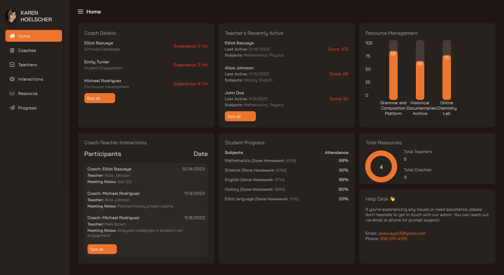
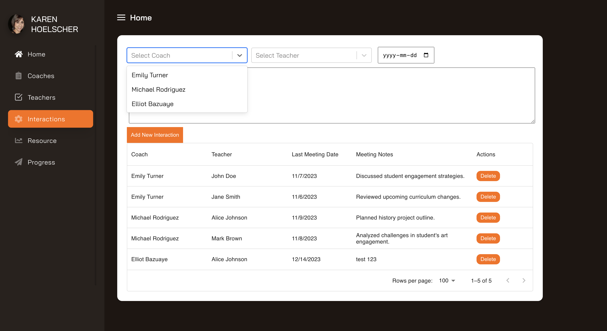

**BRIEF INTRODUCTION** 

################################

This project is build using React.js and Material UI. in communicating with the backend rest apis,

################################

**SET UP**

RUN CMD: 

npm install  (you install all dependencies)

RUN CMD: 

npm start (to start the frontend server) - http://localhost:3000

################################

**---------------FUNCTIONALITIES-----------**

#### -----DASHBOARD----- 

#### DESIGN IDEA 
The dashboard was built with plan of allowing the administrator quickly see different data at the home page, like 'Coach Details' showing 
top 3 most recent coaches that joined the platform, Teachers activities showing the top 3 most recently active, resource management showing a little
nice chart of the data, and it picks 3 random data to display, so it is not static and you can see at a glance what is going on, 
coach & teachers interactions showing the most recent 3, i have subjects progress showing 14 data at a time, i also keep track of the numbers of coach, teachers and resources, lastly a little help desk that administrator can easily reach out to. 

This gives a little overview and they are able to go in and view all details of use the side navigation

The design was made with simplicity in mind, and i didn't want to make it complicated. it's easy to navigate and understand what each section is supposed to do

####   ---------- TABLES WITH RELATIONSHIPS --------------

while some of the menu had relations like the interactions that references the teachers and coaches, i ensured to factor that in the backend and also 
i made for easy usage in creating a new interaction, i used a dropdown showing the names instead of having ids all over the place.

####   ---------- SERVICES NOT INCLUDED DUE TO TIME CONSTRAINTS --------------

I did not make use of the get by id and update endpoints because of time constrain. 
but i however created the endpoints at the backend and are ready to use in the utils/api.js
